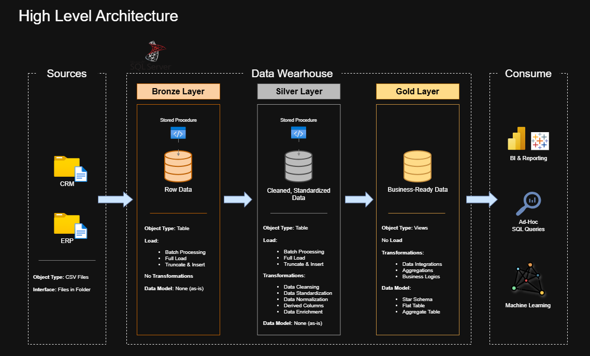
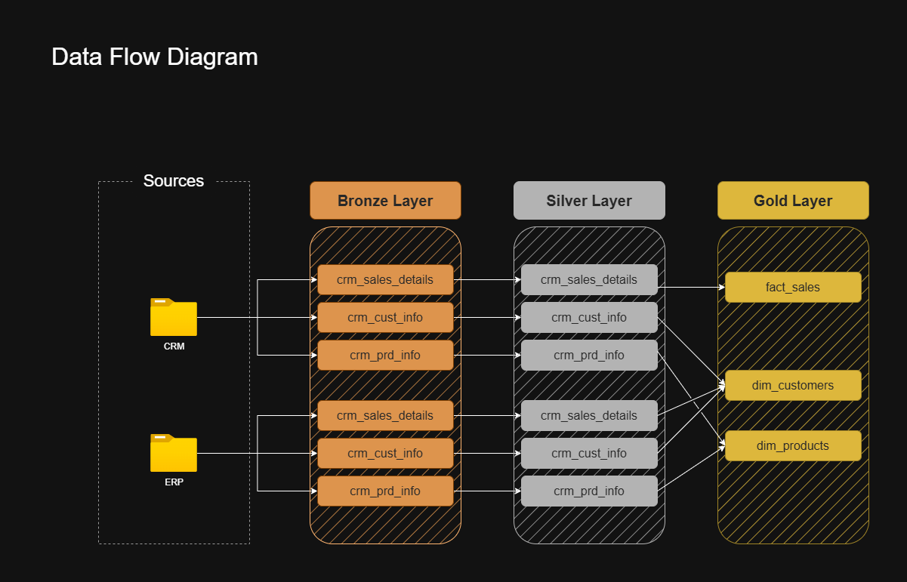
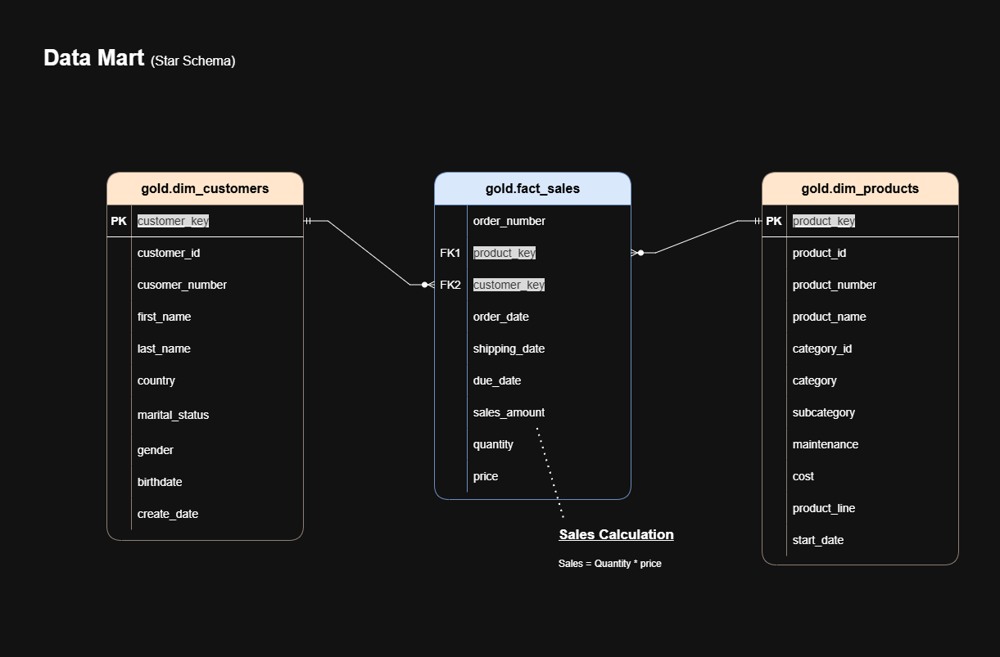

# 🏢 SQL Data Warehouse Project

<div align="center">



**A comprehensive end-to-end data warehousing solution built with SQL Server**

[](https://opensource.org/licenses/MIT)
[](https://www.microsoft.com/en-us/sql-server)

</div>

---

## 📋 Table of Contents

- [Overview](#-overview)
- [Key Features](#-key-features)
- [Data Architecture](#️-data-architecture)
- [Technology Stack](#-technology-stack)
- [Project Structure](#-project-structure)
- [Getting Started](#-getting-started)
- [ETL Pipeline](#-etl-pipeline)
- [Data Model](#-data-model)
- [Analytics & Reporting](#-analytics--reporting)
- [Documentation](#-documentation)
- [License](#️-license)
- [Acknowledgments](#-acknowledgments)

---

## 🎯 Overview

This project demonstrates a **production-ready data warehouse implementation** using SQL Server and the Medallion Architecture pattern. It showcases best practices in data engineering, ETL pipeline development, dimensional modeling, and SQL-based analytics.

### Business Context

The solution consolidates data from two disparate source systems (CRM and ERP) into a unified analytical platform, enabling stakeholders to:

- 📊 Analyze customer behavior and demographics
- 📈 Track product performance and inventory
- 💰 Monitor sales trends and revenue metrics
- 🎯 Make data-driven business decisions

This repository serves as an **excellent portfolio project** for:
- Data Engineers
- Analytics Engineers
- BI Developers
- Database Administrators
- Data Analysts

---

## ✨ Key Features

- **🏗️ Medallion Architecture**: Bronze, Silver, and Gold layer implementation
- **🔄 ETL Pipelines**: Automated data ingestion and transformation using T-SQL stored procedures
- **⭐ Star Schema Design**: Optimized dimensional model for analytical queries
- **📊 Data Quality**: Built-in data cleansing, deduplication, and validation
- **📝 Comprehensive Documentation**: Detailed data catalogs, naming conventions, and architecture diagrams
- **🎨 Visual Diagrams**: Data flow, architecture, and model visualizations using Draw.io
- **🧪 Testing Framework**: Quality assurance and validation scripts

---

## 🏗️ Data Architecture

The project follows the **Medallion Architecture** pattern with three distinct layers:

### 🥉 Bronze Layer (Raw Data)
- **Purpose**: Stores raw data exactly as received from source systems
- **Source**: CSV files from CRM and ERP systems
- **Processing**: Minimal transformations; data loaded via BULK INSERT
- **Tables**: 
  - `bronze.crm_cust_info` - Customer information from CRM
  - `bronze.crm_prd_info` - Product information from CRM
  - `bronze.crm_sales_details` - Sales transactions from CRM
  - `bronze.erp_cust_az12` - Customer demographics from ERP
  - `bronze.erp_loc_a101` - Customer location data from ERP
  - `bronze.erp_px_cat_g1v2` - Product category data from ERP

### 🥈 Silver Layer (Cleansed Data)
- **Purpose**: Cleansed, validated, and standardized data
- **Processing**: 
  - Data quality checks and validation
  - Deduplication and null handling
  - Standardization of formats and values
  - Business rule application
- **Tables**: 
  - `silver.crm_cust_info` - Cleansed customer information
  - `silver.crm_prd_info` - Cleansed product information
  - `silver.crm_sales_details` - Cleansed sales transactions
  - `silver.erp_cust_az12` - Cleansed customer demographics
  - `silver.erp_loc_a101` - Cleansed location data
  - `silver.erp_px_cat_g1v2` - Cleansed product categories

### 🥇 Gold Layer (Business-Ready Data)
- **Purpose**: Analytical star schema for reporting and BI
- **Design Pattern**: Star schema with fact and dimension tables
- **Tables**: 
  - `gold.dim_customers` - Customer dimension
  - `gold.dim_products` - Product dimension with category hierarchy
  - `gold.fact_sales` - Sales fact table



---

## 🛠 Technology Stack

| Component | Technology |
|-----------|-----------|
| **Database** | Microsoft SQL Server (Express/Developer Edition) |
| **IDE** | SQL Server Management Studio (SSMS) |
| **Version Control** | Git & GitHub |
| **Diagramming** | Draw.io |
| **Languages** | T-SQL |
| **Data Format** | CSV |

---

## 📂 Project Structure

```
sql-data-warehouse-project/
│
├── 📁 datasets/                          # Source data files
│   ├── source_crm/                       # CRM system exports
│   │   ├── cust_info.csv
│   │   ├── prd_info.csv
│   │   └── sales_details.csv
│   └── source_erp/                       # ERP system exports
│       ├── CUST_AZ12.csv
│       ├── LOC_A101.csv
│       └── PX_CAT_G1V2.csv
│
├── 📁 docs/                              # Project documentation
│   ├── data_architecture.png             # Architecture overview
│   ├── data_architecture.drawio          # Editable architecture diagram
│   ├── data_catalog.md                   # Data dictionary
│   ├── data_flow.png                     # ETL flow visualization
│   ├── data_flow.drawio                  # Editable flow diagram
│   ├── data_integration.png              # Integration patterns
│   ├── data_model.png                    # Star schema diagram
│   ├── data_model.drawio                 # Editable data model
│   ├── naming_conventions.md             # Naming standards
│   ├── ETL.png                           # ETL methodology
│   └── Project_Notes_Sketches.pdf        # Project notes
│
├── 📁 scripts/                           # SQL scripts
│   ├── init_database.sql                 # Database and schema creation
│   │
│   ├── bronze/                           # Bronze layer scripts
│   │   ├── ddl_bronze.sql               # Table definitions
│   │   └── proc_load_bronze.sql         # Data loading procedure
│   │
│   ├── silver/                           # Silver layer scripts
│   │   ├── ddl_silver.sql               # Table definitions
│   │   └── proc_load_silver.sql         # Transformation procedure
│   │
│   └── gold/                             # Gold layer scripts
│       └── ddl_gold.sql                  # View definitions (Star Schema)
│
├── 📁 tests/                             # Quality assurance scripts
│
├── 📄 README.md                          # Project documentation (this file)
├── 📄 LICENSE                            # MIT License
└── 📄 .gitignore                         # Git ignore rules
```

---

## 🚀 Getting Started

### Prerequisites

1. **SQL Server** (Express or Developer Edition)
   - [Download SQL Server](https://www.microsoft.com/en-us/sql-server/sql-server-downloads)
   
2. **SQL Server Management Studio (SSMS)**
   - [Download SSMS](https://learn.microsoft.com/en-us/sql/ssms/download-sql-server-management-studio-ssms)

3. **Git** (for version control)
   - [Download Git](https://git-scm.com/downloads)

### Installation Steps

1. **Clone the repository**
   ```bash
   git clone https://github.com/gooliverani/sql-data-warehouse-project.git
   cd sql-data-warehouse-project
   ```

2. **Set up the database**
   - Open SSMS and connect to your SQL Server instance
   - Open `scripts/init_database.sql`
   - Execute the script to create the `DataWarehouse` database and schemas

   ⚠️ **Warning**: This script will drop the existing database if it exists!

3. **Create Bronze layer tables**
   - Execute `scripts/bronze/ddl_bronze.sql`
   - This creates all bronze layer table structures

4. **Create Silver layer tables**
   - Execute `scripts/silver/ddl_silver.sql`
   - This creates all silver layer table structures

5. **Create Gold layer views**
   - Execute `scripts/gold/ddl_gold.sql`
   - This creates the star schema views for analytics

6. **Update file paths** (Important!)
   - Open `scripts/bronze/proc_load_bronze.sql`
   - Update the CSV file paths to match your local directory structure
   - Example: Replace `C:\Courses\sql-data-warehouse-project\...` with your actual path

7. **Load the data**
   ```sql
   -- Load Bronze layer
   EXEC bronze.load_bronze;
   
   -- Transform and load Silver layer
   EXEC silver.load_silver;
   
   -- Gold layer views are automatically populated
   ```

---

## 🔄 ETL Pipeline

The ETL pipeline is implemented using T-SQL stored procedures with the following workflow:

### 1. **Extract (Source → Bronze)**

```sql
EXEC bronze.load_bronze;
```

- Ingests raw CSV files using `BULK INSERT`
- No transformations applied
- Data loaded into bronze schema tables
- Includes error handling and logging

### 2. **Transform (Bronze → Silver)**

```sql
EXEC silver.load_silver;
```

**Transformations include:**
- **Data Cleansing**: Trim whitespace, handle nulls
- **Standardization**: Normalize gender and marital status values
- **Deduplication**: Keep most recent customer records
- **Type Conversion**: Convert date formats and integer codes
- **Business Rules**: Apply domain-specific logic

### 3. **Load (Silver → Gold)**

The Gold layer uses **views** that automatically pull from Silver:

```sql
-- Views are materialized when queried
SELECT * FROM gold.dim_customers;
SELECT * FROM gold.dim_products;
SELECT * FROM gold.fact_sales;
```

**Gold layer features:**
- **Surrogate Keys**: Generated using `ROW_NUMBER()`
- **Star Schema**: Optimized for analytical queries
- **Data Enrichment**: Joins across multiple sources
- **Historical Filtering**: Active records only


---

## 📊 Data Model

The Gold layer implements a **star schema** optimized for analytical queries.

### Dimension Tables

#### 👥 `gold.dim_customers`
Customer dimension with demographic information

| Column | Description |
|--------|-------------|
| `customer_key` | Surrogate key |
| `customer_id` | Natural key from source |
| `customer_number` | Business key |
| `first_name` | Customer first name |
| `last_name` | Customer last name |
| `country` | Customer location |
| `marital_status` | Single/Married |
| `gender` | Male/Female (with fallback logic) |
| `birthdate` | Date of birth |
| `create_date` | Account creation date |

#### 🏷️ `gold.dim_products`
Product dimension with category hierarchy

| Column | Description |
|--------|-------------|
| `product_key` | Surrogate key |
| `product_id` | Natural key from source |
| `product_number` | Business key |
| `product_name` | Product description |
| `category_id` | Category identifier |
| `category` | Main category |
| `subcategory` | Product subcategory |
| `maintenance` | Maintenance flag |
| `cost` | Product cost |
| `product_line` | Product line code |
| `start_date` | Product launch date |

### Fact Table

#### 💰 `gold.fact_sales`
Sales transactions with measures and foreign keys

| Column | Description |
|--------|-------------|
| `order_number` | Order identifier |
| `product_key` | FK to dim_products |
| `customer_key` | FK to dim_customers |
| `order_date` | Order placement date |
| `shipping_date` | Shipment date |
| `due_date` | Expected delivery date |
| `sales_amount` | Revenue amount |
| `quantity` | Units sold |
| `price` | Unit price |



---

## 📈 Analytics & Reporting

The Gold layer supports various analytical queries:

### Example Queries

**Customer Analysis:**
```sql
-- Top customers by revenue
SELECT 
    c.first_name + ' ' + c.last_name AS customer_name,
    c.country,
    SUM(f.sales_amount) AS total_revenue,
    COUNT(DISTINCT f.order_number) AS order_count
FROM gold.fact_sales f
JOIN gold.dim_customers c ON f.customer_key = c.customer_key
GROUP BY c.first_name, c.last_name, c.country
ORDER BY total_revenue DESC;
```

**Product Performance:**
```sql
-- Product sales by category
SELECT 
    p.category,
    p.subcategory,
    COUNT(DISTINCT f.order_number) AS orders,
    SUM(f.quantity) AS units_sold,
    SUM(f.sales_amount) AS revenue
FROM gold.fact_sales f
JOIN gold.dim_products p ON f.product_key = p.product_key
GROUP BY p.category, p.subcategory
ORDER BY revenue DESC;
```

**Sales Trends:**
```sql
-- Monthly sales trend
SELECT 
    YEAR(order_date) AS year,
    MONTH(order_date) AS month,
    COUNT(DISTINCT order_number) AS orders,
    SUM(sales_amount) AS revenue,
    AVG(sales_amount) AS avg_order_value
FROM gold.fact_sales
GROUP BY YEAR(order_date), MONTH(order_date)
ORDER BY year, month;
```

---

## 📖 Documentation

Comprehensive documentation is available in the `docs/` folder:

- **[Data Catalog](docs/data_catalog.md)** - Complete data dictionary with field descriptions
- **[Naming Conventions](docs/naming_conventions.md)** - Standards for tables, columns, and objects
- **Architecture Diagrams** - Visual representations of system design
- **Data Flow Diagrams** - ETL process visualization
- **Data Model Diagrams** - Star schema structure

All diagrams are available in both PNG format (for viewing) and Draw.io format (for editing).

---

## 🛡️ License

This project is licensed under the **MIT License**. See the [LICENSE](LICENSE) file for details.

You are free to:
- ✅ Use this project for personal or commercial purposes
- ✅ Modify and distribute the code
- ✅ Use it in your portfolio

**Attribution is appreciated but not required.**

---

## 🌟 Acknowledgments

This project is part of the comprehensive **sql-data-warehouse course** by [**DataWithBaraa**](https://www.datawithbaraa.com/). Special thanks to Baraa for creating excellent educational content on data engineering, analytics and SQL.

### Connect with DataWithBaraa:
- 🎥 [YouTube Channel](https://www.youtube.com/@DataWithBaraa) - Free tutorials and courses
- 🌐 [Website](https://www.datawithbaraa.com/) - Additional resources and content
- 💻 [GitHub](https://github.com/DataWithBaraa) - Code repositories and projects

---

<div align="center">

**If you found this project helpful, please consider giving it a ⭐**

Made with ❤️ by [gooliverani](https://github.com/gooliverani)

</div>